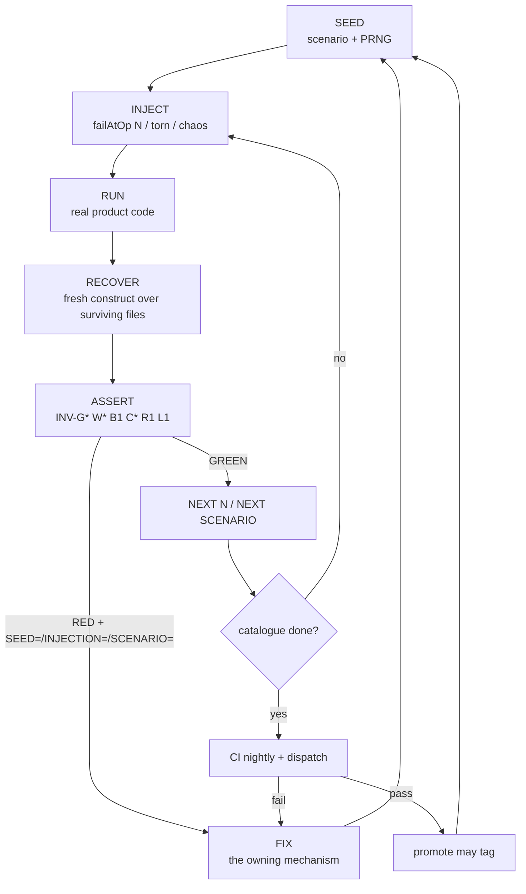
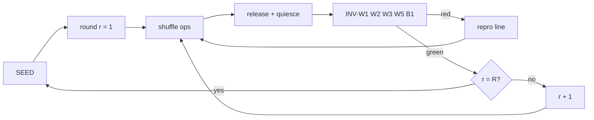
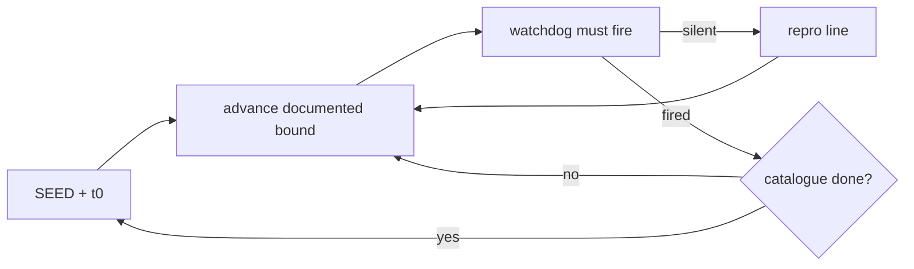
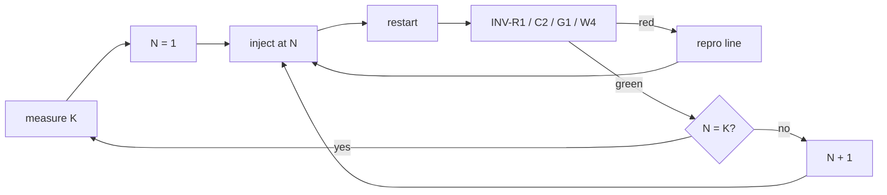

# Destructive suite — closed loop

The suite is one cycle. Every path returns to seed. Nothing exits the loop except a loud, reproducible failure.

## Ideal cycle (self-balanced)

## H3 interleave (same loop, shuffled)

## H4 soak (same loop, virtual time)

## H1 crash sweep (same loop, smaller)

## What is in this tree

| Path | Invariants |
|---|---|
| `crash/goal-usage.destructive.test.ts` | G1 G2 G3 R1 |
| `crash/worker-terminal-handoff.destructive.test.ts` | W4 |
| `crash/compaction-checkpoint.destructive.test.ts` | C1 C2 R1 |
| `crash/worker-ledger-compaction.destructive.test.ts` | W1 W2 W4 C2 R1 |
| `crash/worker-invariants.destructive.test.ts` | W3 W5 W6 B1 |
| `crash/h1b-real-kill.destructive.test.ts` | R1 (SIGKILL / taskkill) |
| `chaos/goal-loop-chaos.destructive.test.ts` | L1 |
| `stress/interleave.destructive.test.ts` | W1 W2 W3 W5 B1 |
| `soak/liveness.destructive.test.ts` | L1 W4 W5 W6 |
| `harness/invariants.destructive.test.ts` | every checker red then green |

Never part of `npm test`. Run `npm run test:destructive` from the repo root.

H3 also runs a rotating nightly seed (`DESTRUCTIVE_NIGHTLY_SEED`, defaulting to UTC `YYYYMMDD`). A failing seed is pinned into the fixed set next to its fix.

Load, transform, and execution stay off the default suite:

- `vitest.config.ts` excludes `test-destructive/**` so `npm test` does not collect, transform, or run these files.
- This project uses Node's native TypeScript loader (`viteModuleRunner: false`). No Vite transform graph.
- One isolate / one worker: the import graph is paid once, then files run sequentially. Do not turn `isolate` back on to "be safe" — that re-transforms the same graph per file.
